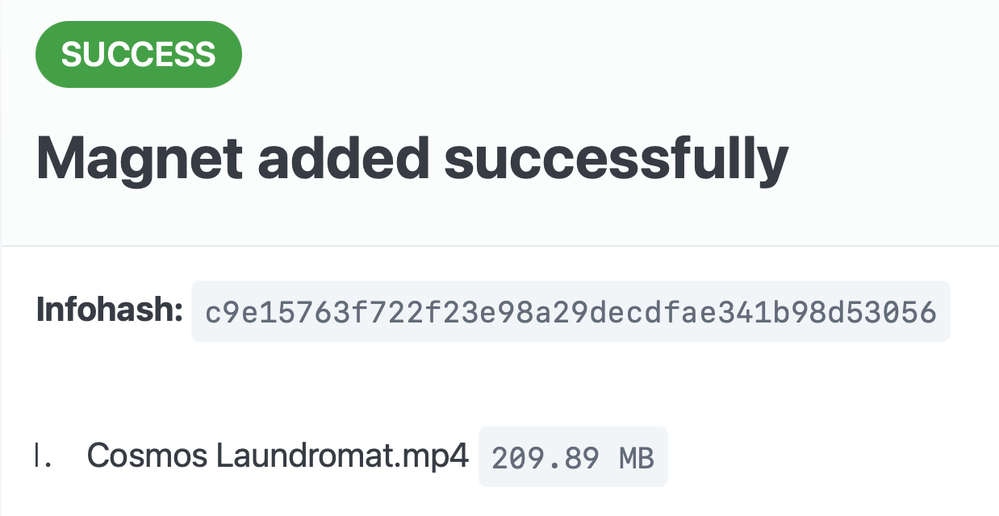

# Add Magnet Link

**`add-magnet-link`** is a Cloudflare Worker that makes it easy to add magnet links via a simple URL and a [qBittorrent API] endpoint.

Safari does not allow web apps to handle [`magnet:`](//wikipedia.org/wiki/Magnet_URI_scheme) and other [URL schemes][tweet]. This tool simplifies adding magnet links using the qBittorent API when using Safari and other apps.

[tweet]: https://x.com/andrewe/status/1919765382438518918 "tweet by @andrewe"

<p align="center">
  <a href="screenshot-success.png">
    
  </a>
</p>

## Features

- **receives magnet link or infohash via URL in path**: \
  `https://add.{user}.workers.dev/{magnet link}` \
  `https://add.{user}.workers.dev/{infohash}`

- **adds magnet links using the qBittorrent API**

## Deploy to Cloudflare

1. Use the [Cloudflare Dashboard](https://deploy.workers.cloudflare.com/?url=https://github.com/andesco/add-magnet-link) or [Deploy to Cloudflare](https://deploy.workers.cloudflare.com/?url=https://github.com/andesco/add-magnet-link) directly:

   Workers → Create an application → [Clone a repository](https://deploy.workers.cloudflare.com/?url=https://github.com/andesco/add-magnet-link):
   ```
   https://github.com/andesco/add-magnet-link
   ```

   [](https://deploy.workers.cloudflare.com/?url=https://github.com/andesco/add-magnet-link)

2. Set this text variables to point to your qBittorrent API:\
   `API_BASE_URL`

3. Visit your worker URL to authenticate:\
  `https://add-magnet-link.{user}.workers.dev`

## Add Magnet Link via URL

**full magnet link**:\
`https://add-magnet-link.{user}.workers.dev/magnet:?xt=urn:btih:{infohash}`

**infohash only**:\
`https://add-magnet-link.{user}.workers.dev/{infohash}`

## Redirect Magnet Scheme

A browser extension that supports URL redirect rules can be used to redirect magnet links to this service.

**URL Matching Pattern:**\
`/^magnet:\?xt=urn:btih:([A-Fa-f0-9]+)(?:&.*)?$/`

**Replacement:**\
`https://add.{user}.workers.dev/$1`

**[StopTheMadness Pro](https://apple.co/4e0lkPG)** is a powerful Safari browser extension that supports [URL redirect rules](https://underpassapp.com/StopTheMadness/Pro/Docs/Redirects.html).

## Configuration

### Environment Variables & Secrets

Variable       | Description              | Type
---------------|--------------------------|----------------
`API_BASE_URL` | qBittorrent API URL      | Required Text
`API_USERNAME` | qBittorrent API username | Optional Secret
`API_PASSWORD` | qBittorrent API password | Optional Secret

### Authentication

**Default Web Login**: Authenticate via web form using [qBittorrent API] credentials. Authentication is saved for 1 year via a secure cookie.

**Optional Environment Variables**: Set `API_USERNAME` and `API_PASSWORD` as secrets to bypass web login. This is useful when securing your worker with Cloudflare Access or for personal/local deployments.

## Troubleshooting

#### Authentication Issues

- Verify `API_BASE_URL` is set correctly and accessible from Cloudflare.
- Check `API_USERNAME` and `API_PASSWORD` are correct.
- Ensure qBittorrent WebUI API is enabled and accessible.

#### Test Magnet Links

Cosmos Laundromat: [magnet link][Cosmos Laundromat] \
Sintel: [magnet link][Sintel] \
Tears of Steel: [magnet link][Tears of Steel]

> [!Note]
> GitHub does not render `magnet:` scheme links.

[qBittorrent API]: https://github.com/qbittorrent/qBittorrent/wiki#WebUI-API

[Cosmos Laundromat]: <magnet:?xt=urn:btih:c9e15763f722f23e98a29decdfae341b98d53056&amp;dn=Cosmos+Laundromat&amp;tr=udp%3A%2F%2Fexplodie.org%3A6969&amp;tr=udp%3A%2F%2Ftracker.coppersurfer.tk%3A6969&amp;tr=udp%3A%2F%2Ftracker.empire-js.us%3A1337&amp;tr=udp%3A%2F%2Ftracker.leechers-paradise.org%3A6969&amp;tr=udp%3A%2F%2Ftracker.opentrackr.org%3A1337&amp;tr=wss%3A%2F%2Ftracker.btorrent.xyz&amp;tr=wss%3A%2F%2Ftracker.fastcast.nz&amp;tr=wss%3A%2F%2Ftracker.openwebtorrent.com&amp;ws=https%3A%2F%2Fwebtorrent.io%2Ftorrents%2F&amp;xs=https%3A%2F%2Fwebtorrent.io%2Ftorrents%2Fcosmos-laundromat.torrent">
[Sintel]: <magnet:?xt=urn:btih:08ada5a7a6183aae1e09d831df6748d566095a10&amp;dn=Sintel&amp;tr=udp%3A%2F%2Fexplodie.org%3A6969&amp;tr=udp%3A%2F%2Ftracker.coppersurfer.tk%3A6969&amp;tr=udp%3A%2F%2Ftracker.empire-js.us%3A1337&amp;tr=udp%3A%2F%2Ftracker.leechers-paradise.org%3A6969&amp;tr=udp%3A%2F%2Ftracker.opentrackr.org%3A1337&amp;tr=wss%3A%2F%2Ftracker.btorrent.xyz&amp;tr=wss%3A%2F%2Ftracker.fastcast.nz&amp;tr=wss%3A%2F%2Ftracker.openwebtorrent.com&amp;ws=https%3A%2F%2Fwebtorrent.io%2Ftorrents%2F&amp;xs=https%3A%2F%2Fwebtorrent.io%2Ftorrents%2Fsintel.torrent>
[Tears of Steel]: <magnet:?xt=urn:btih:209c8226b299b308beaf2b9cd3fb49212dbd13ec&amp;dn=Tears+of+Steel&amp;tr=udp%3A%2F%2Fexplodie.org%3A6969&amp;tr=udp%3A%2F%2Ftracker.coppersurfer.tk%3A6969&amp;tr=udp%3A%2F%2Ftracker.empire-js.us%3A1337&amp;tr=udp%3A%2F%2Ftracker.leechers-paradise.org%3A6969&amp;tr=udp%3A%2F%2Ftracker.opentrackr.org%3A1337&amp;tr=wss%3A%2F%2Ftracker.btorrent.xyz&amp;tr=wss%3A%2F%2Ftracker.fastcast.nz&amp;tr=wss%3A%2F%2Ftracker.openwebtorrent.com&amp;ws=https%3A%2F%2Fwebtorrent.io%2Ftorrents%2F&amp;xs=https%3A%2F%2Fwebtorrent.io%2Ftorrents%2Ftears-of-steel.torrent>
